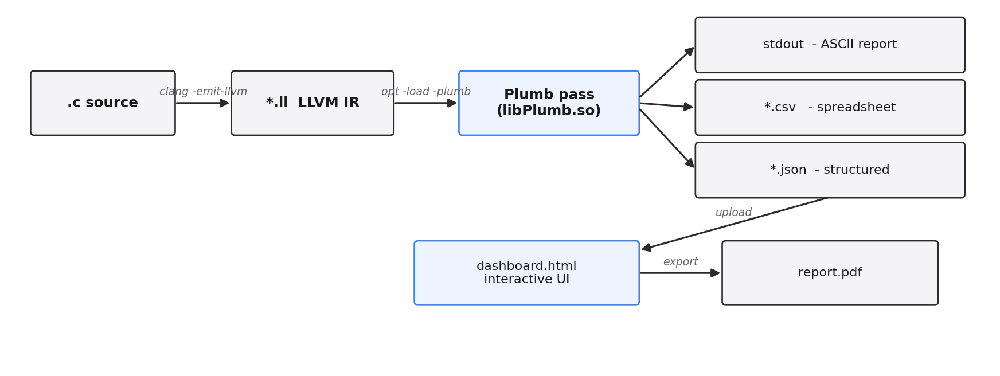
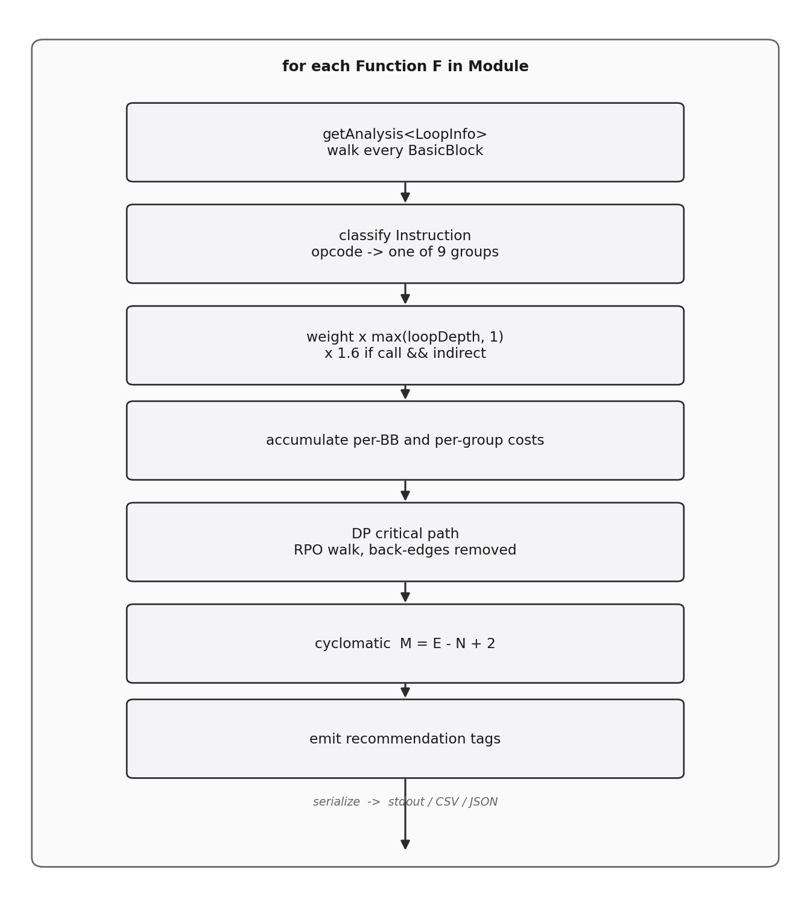
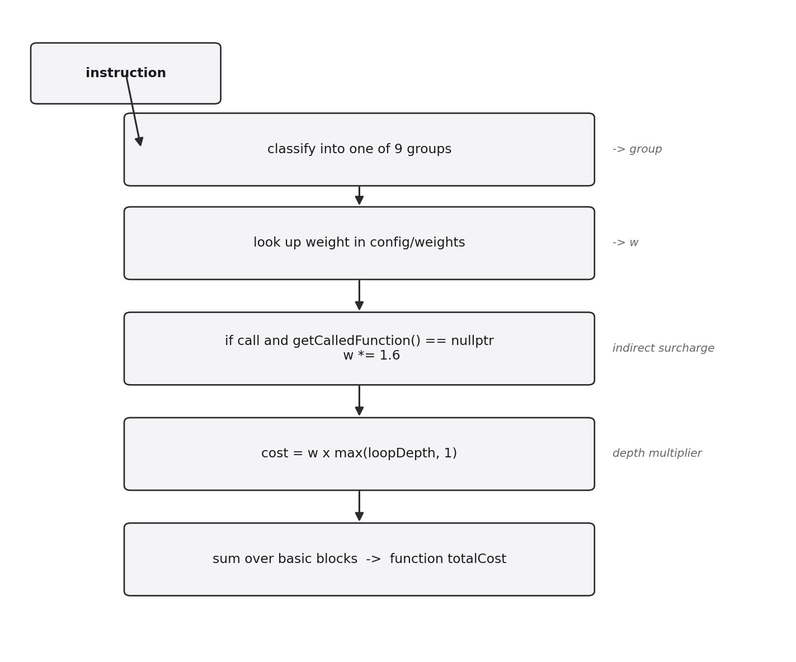
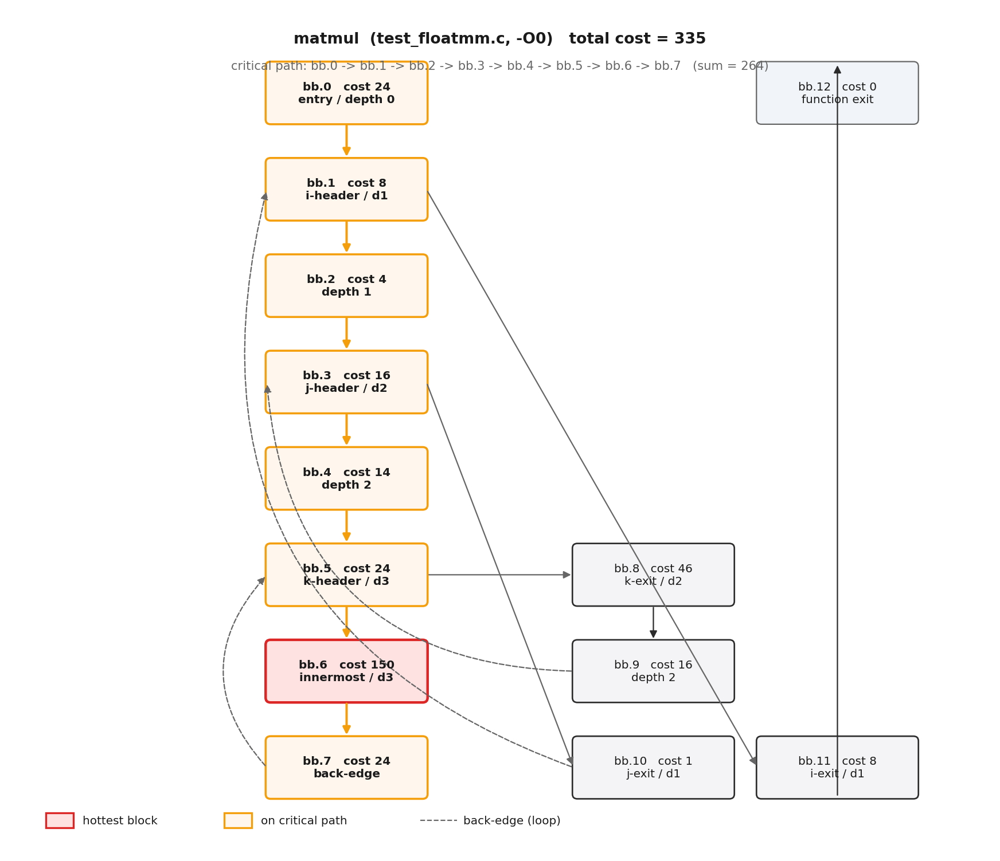

<div align="center">

# Plumb

### *Plumb the depth of your IR.*

**A static cost-model analysis pass for LLVM that knows the difference between an `add` and a chase through a function pointer.**

[](https://llvm.org)
[](https://en.cppreference.com/w/cpp/14)
[](https://cmake.org)
[](#)
[](#)
[](LICENSE)



```bash
./build.sh && ./run.sh
```

</div>

---

## Why this exists

A naive instruction count ranks two functions equal if they have the same number of instructions, even when one is a tight integer loop and the other is a chain of memory-bound calls. **Plumb assigns a cost to every IR instruction, multiplies it by loop nesting depth, surcharges indirect calls, then traces the worst-case path through every CFG.**

Every cost number traces back to `(group, count, weight, depth)` — no black-box scores.

> **Real example.** On the `matmul()` from `testcases/test_floatmm.c`, raw instruction count says 78. Plumb at default weights says 335 — and pinpoints `bb.6` (the depth-3 inner accumulator) as the hot block carrying ~45% of total cost. After `-O2`, that drops to 81 (−76%), with the hotspot moving cleanly out of the inner body. [See §3.4 in EVALUATION.md](EVALUATION.md#34-test_floatmmc--depth-multiplier-in-action)

---

## Table of contents

- [At a glance](#at-a-glance)
- [Architecture](#architecture)
- [Cost model in 30 seconds](#cost-model-in-30-seconds)
- [Quick start](#quick-start)
- [Testcase suite](#testcase-suite)
- [The dashboard](#the-dashboard)
- [Output formats](#output-formats)
- [Pass options](#pass-options)
- [Repository layout](#repository-layout)
- [Documents](#documents)
- [Tech stack](#tech-stack)
- [License](#license)

---

## At a glance

<table>
<tr>
<td width="50%" valign="top">

### What you get

- LLVM `FunctionPass` (legacy PM)
- Per-instruction classification into 9 groups
- Configurable weights (`config/weights.cfg`)
- Loop-depth cost multiplier
- Indirect-call ×1.6 surcharge
- Critical-path discovery (DP over RPO)
- Cyclomatic complexity (McCabe)
- Energy estimate (Horowitz pJ/op table)
- 5 recommendation tags
- CSV + JSON output
- Single-file interactive dashboard

</td>
<td width="50%" valign="top">

### Recommendation tags

| Tag | When |
|---|---|
| `HOTSPOT` | total cost > threshold |
| `INLINE_CANDIDATE` | small leaves |
| `VECTORIZABLE` | loops with no calls |
| `RECURSIVE` | direct self-call detected |
| `HIGH_COMPLEXITY` | cyclomatic ≥ 10 |

### Verified on

- macOS (Apple Silicon, Homebrew LLVM 14)
- Ubuntu 22.04 (`clang-14` / `opt-14`)

</td>
</tr>
</table>

---

## Architecture

The pipeline is three stages: produce IR, run the analysis pass, render the report. Every stage is decoupled — `Plumb.cpp` doesn't know about the dashboard, and the dashboard doesn't know about LLVM.

<div align="center">
  
</div>

Inside the pass itself, each function is processed through a fixed sequence of stages:

<div align="center">
  
</div>

---

## Cost model in 30 seconds

<div align="center">
  
</div>

### The 9 groups (with default weights)

| Group | Weight | Energy¹ pJ/op | LLVM opcodes |
|---|:-:|:-:|---|
| **`add`**     | 1 | 0.4  | `Add`, `Sub`, `FAdd`, `FSub`, `And`, `Or`, `Xor`, shifts |
| **`mul`**     | 2 | 3.4  | `Mul`, `FMul`, `*Div`, `*Rem` |
| **`memory`**  | 3 | 50   | `Load`, `Store`, atomics, `Fence` |
| **`call`**    | 5 | 100  | `Call`, `Invoke` *(×1.6 if indirect)* |
| **`branch`**  | 1 | 0.1  | `Br`, `Switch`, `IndirectBr` |
| **`compare`** | 1 | 0.1  | `ICmp`, `FCmp` |
| **`cast`**    | 1 | 0.5  | every `CastInst` opcode |
| **`alloca`**  | 1 | 5    | `Alloca` |
| **`phi`**     | 0 | 0.05 | `PHI` |
| **`other`**   | 0 | 1.0  | `Ret`, `GetElementPtr`, `Select`, ... |

¹ pJ figures inspired by Horowitz, *ISSCC 2014* — order-of-magnitude only, not absolute device wattage.

> **Why static depth and not block frequency?** Because every cost number must trace back to (count, weight, depth). A `BlockFrequencyInfo` multiplier is a heuristic guess; a depth integer is auditable. Full rationale in [DESIGN.md §3](DESIGN.md#3-cost-model-weight-×-static-loop-depth).

---

## Quick start

### Prerequisites

| Platform | Install command |
|---|---|
| **macOS** (Homebrew) | `brew install llvm@14 cmake` |
| **Ubuntu / Debian**  | `sudo apt install llvm-14 llvm-14-dev clang-14 cmake` |

> Plumb deliberately targets the **legacy** pass-manager API (`FunctionPass` / `RegisterPass`) which was removed in LLVM 17. Versions 14, 15, and 16 are supported. The build script auto-detects all three.

### Build and run

```bash
./build.sh        # -> build/libPlumb.{so,dylib}
./run.sh          # -> ir/, results/, opens dashboard
```

```bash
./run.sh --no-open   # skip browser launch (CI-friendly)
```

If LLVM auto-detection ever fails, pin a specific install:

```bash
LLVM_DIR=$(brew --prefix llvm@14)/lib/cmake/llvm ./build.sh   # macOS
LLVM_DIR=/usr/lib/llvm-14/lib/cmake/llvm        ./build.sh   # Ubuntu
```

### What you'll see

```
pass built: build/libPlumb.dylib
-- test_floatmm @ -O0 -----------------------------------
[Plumb] Loaded weights from: config/weights.cfg
+==========================================================+
  Plumb  >>  Function: matmul
+==========================================================+
  Total weighted cost     : 335
  Loop count / max depth  : 1 / 3
  Most expensive group    : memory (cost=246)
  Critical Path (worst-case):  cost = 264
    bb.0 -> bb.1 -> bb.2 -> bb.3 -> bb.4 -> bb.5 -> bb.6 -> bb.7
  Recommendations         : HOTSPOT
  *** HOTSPOT WARNING: cost 335 exceeds threshold 30 ***
```

...then the dashboard opens with twelve JSON reports ready to load.

---

## Testcase suite

Six C programs, each engineered to stress a different cost class. Each is run at both `-O0` and `-O2`, producing **12 reports**.

| # | Testcase | Stresses | Expected dominant group | Top-line at O0 |
|---:|:---|:---|:---:|---:|
| 1 | [`test_arith.c`](testcases/test_arith.c)         | mixed arithmetic + nested loops + calls          | spread       | 493 |
| 2 | [`test_branchy.c`](testcases/test_branchy.c)     | switch + nested ifs (high cyclomatic complexity) | branch + mem | 303 |
| 3 | [`test_callchain.c`](testcases/test_callchain.c) | direct + indirect (function pointer) calls       | call         | 229 |
| 4 | [`test_floatmm.c`](testcases/test_floatmm.c)     | triple-nested float matmul (depth 3)             | memory       | **514** |
| 5 | [`test_memheavy.c`](testcases/test_memheavy.c)   | 5-point stencil + indirect-load reduction        | memory       | 355 |
| 6 | [`test_recursive.c`](testcases/test_recursive.c) | self-recursion + leaf functions                  | call         | 164 |

Per-testcase findings, per-function deltas, and the failure cases live in [**EVALUATION.md**](EVALUATION.md).

### A peek at `matmul` (test_floatmm.c, -O0)

The depth-3 inner loop (bb.5 → bb.6 → bb.7) carries the cost. `bb.6` alone is **150 / 335 = 45%** of the function — exactly because every load gets a ×3 depth multiplier on top of its weight 3.

<div align="center">
  
</div>

---

## The dashboard

Open `dashboard/dashboard.html` after a run. Single self-contained HTML, no build step, CDN-loaded libs (Chart.js, Cytoscape.js, html2canvas, jsPDF).

<table>
<tr>
<td width="33%" valign="top">

#### KPI strip

Total cost, functions analysed, hottest function, estimated energy. Shows A↔B deltas when both runs are loaded.

</td>
<td width="33%" valign="top">

#### Cost donut

Aggregate cost per instruction group. Single-hue ramp for readability without competing colors.

</td>
<td width="33%" valign="top">

#### Function ranking

Horizontal bars. **Click any bar** to refocus the BB heatmap and CFG graph on that function.

</td>
</tr>
<tr>
<td valign="top">

#### BB heatmap

One cell per basic block. Color depth = weighted cost. **Critical-path cells are outlined.**

</td>
<td valign="top">

#### CFG graph

Full control-flow graph (Cytoscape). Node size = cost. Critical-path nodes are highlighted.

</td>
<td valign="top">

#### Live weight tuner

Drag any slider, every chart re-renders client-side. Explore "what if `memory` was free?".

</td>
</tr>
<tr>
<td valign="top">

#### Comparison mode

Load A = O0, B = O2. Diff cards per function. Reductions in green, regressions in red.

</td>
<td valign="top">

#### Recommendations

Per-function chips: `HOTSPOT`, `INLINE_CANDIDATE`, `VECTORIZABLE`, `RECURSIVE`, `HIGH_COMPLEXITY`.

</td>
<td valign="top">

#### Sortable table and PDF

Every function with cost / insts / CC / depth / energy / crit-path. One-click PDF export.

</td>
</tr>
</table>

> Demo screenshots live in [`docs/screenshots/`](docs/screenshots/).

---

## Output formats

<details>
<summary><b>Terminal</b> — ASCII tables, BB cost bar chart, critical path</summary>

```
+==========================================================+
  Plumb  >>  Function: matmul
+==========================================================+

  Instruction-Type Analysis:
  +----------+-------+--------+--------+--------------+
  | Group    | Count | Weight |  Cost  | Contribution |
  +----------+-------+--------+--------+--------------+
  | memory   |  38   |   3    | 246    |    73%       |
  | branch   |  12   |   1    |  22    |     6%       |
  | mul      |   3   |   2    |  16    |     4%       |
  | ...                                              |
  +----------+-------+--------+--------+--------------+

  BasicBlock cost bar chart:
  bb.6  |##############################| 150  [CRIT]
  bb.8  |#########                     |  46
  bb.0  |####                          |  24
  ...

  Critical Path (worst-case):  cost = 264
  bb.0 -> bb.1 -> bb.2 -> bb.3 -> bb.4 -> bb.5 -> bb.6 -> bb.7
```

</details>

<details>
<summary><b>CSV</b> — for spreadsheets / awk / CI assertions</summary>

```csv
function,group,count,weight,cost,pct
matmul,memory,38,3,246,73.4
matmul,branch,12,1,22,6.6
matmul,mul,3,2,16,4.8
matmul,call,1,5,15,4.5
matmul,add,6,1,14,4.2
...
```

</details>

<details>
<summary><b>JSON</b> — structured, dashboard-ready</summary>

```json
{
  "metadata": {
    "tool": "Plumb", "runLabel": "O0",
    "weights":      { "add":1, "mul":2, "memory":3, "call":5 },
    "energyModelPj": { "add":0.4, "mul":3.4, "memory":50 },
    "totals":       { "totalCost": 514, "functionCount": 3 }
  },
  "functions": [
    {
      "name": "matmul",
      "totalCost": 335,
      "totalInstructions": 78,
      "cyclomaticComplexity": 4,
      "maxLoopDepth": 3,
      "loopCount": 1,
      "isRecursive": false,
      "energyPj": 4487.9,
      "mostExpensiveGroup": "memory",
      "recommendations": ["HOTSPOT"],
      "criticalPath":     ["bb.0","bb.1","bb.2","bb.3","bb.4","bb.5","bb.6","bb.7"],
      "criticalPathCost": 264,
      "groups":      [ /* per-group {count,weight,cost,pct,indirect} */ ],
      "basicBlocks": [ /* per-BB {label,cost,instructions,loopDepth,isCritical,successors} */ ]
    }
  ]
}
```

The dashboard's **Live Weight Tuner** re-derives all costs client-side from `groups[].count` — which is why the JSON emits counts and weights separately rather than only the multiplied result.

</details>

---

## Pass options

All flags use the `plumb-` prefix to avoid clashing with LLVM's own command-line options (notably the inliner's built-in `-inline-threshold`, which would trip `CommandLineParser::addOption` at `dlopen` time without the prefix). [Full story in IMPLEMENTATION.md §8](IMPLEMENTATION.md#8-command-line-flags)

| Flag | Default | Purpose |
|---|---|---|
| `-plumb-weight-file=PATH`        | *(built-in)* | Path to `key=value` weight table |
| `-plumb-hot-threshold=N`         | `50`         | Functions with cost > N get `HOTSPOT` |
| `-plumb-inline-threshold=N`      | `20`         | Cost < N (and not `main`) gets `INLINE_CANDIDATE` |
| `-plumb-out-file=PATH`           | —            | Write CSV results |
| `-plumb-json-file=PATH`          | —            | Write structured JSON |
| `-plumb-run-label=STR`           | `default`    | Embedded in JSON metadata (`O0` / `O2` for compare) |

### Manual invocation (without `run.sh`)

```bash
opt -enable-new-pm=0 \
    -load build/libPlumb.dylib \
    -plumb \
    -plumb-weight-file=config/weights.cfg \
    -plumb-hot-threshold=30 \
    -plumb-inline-threshold=20 \
    -plumb-run-label=O0 \
    -plumb-out-file=results.csv \
    -plumb-json-file=results.json \
    -disable-output input.ll
```

---

## Repository layout

```
plumb/
├── README.md              <- this file
├── DESIGN.md              <- approach, alternatives, tradeoffs
├── IMPLEMENTATION.md      <- LLVM-API specifics, build details
├── EVALUATION.md          <- measured results across 6 testcases
├── LICENSE                <- MIT
├── build.sh               <- compiles the pass
├── run.sh                 <- runs analysis, opens dashboard
├── src/
│   ├── Plumb.cpp          <- the LLVM pass (~890 LoC)
│   └── CMakeLists.txt     <- LLVM-14/15/16 build glue
├── config/
│   └── weights.cfg        <- editable cost table
├── testcases/             <- 6 C programs, each stressing a different class
│   ├── test_arith.c
│   ├── test_branchy.c
│   ├── test_callchain.c
│   ├── test_floatmm.c
│   ├── test_memheavy.c
│   └── test_recursive.c
├── dashboard/
│   └── dashboard.html     <- interactive UI (single file, CDN libs)
├── scripts/
│   └── _llvm_env.sh       <- shared LLVM toolchain detection
└── docs/
    ├── diagrams/          <- README diagrams (matplotlib-rendered PNGs)
    └── screenshots/       <- demo captures
```

After running `./run.sh`, three more directories appear (all `.gitignore`d):

```
build/      compiled pass library
ir/         LLVM IR for every testcase x {O0,O2}
results/    one CSV + one JSON per (testcase, opt-level) pair
```

---

## Documents

| Doc | What's inside | Read it for |
|---|---|---|
| [README.md](README.md)               | This file       | overview, quick start, dashboard tour |
| [DESIGN.md](DESIGN.md)               | 10 sections     | approach, alternatives considered, tradeoff decisions, what's out of scope |
| [IMPLEMENTATION.md](IMPLEMENTATION.md) | 11 sections   | LLVM API specifics, classification table, the macOS `dynamic_lookup` linker workaround, the flag-prefix collision story |
| [EVALUATION.md](EVALUATION.md)       | 6 sections     | per-testcase findings, three-model baseline comparison, §5 four honest failure modes |

---

## Tech stack

| Layer | Stack |
|---|---|
| **Pass**       | C++14, LLVM 14 (legacy PM), CMake ≥ 3.13 |
| **Config**     | `key=value` text, hot-reload via dashboard |
| **Output**     | stdout (ASCII), CSV, JSON |
| **Dashboard**  | vanilla JS, Chart.js, Cytoscape.js, html2canvas, jsPDF (all CDN, cached) |
| **Portability**| bash 3.2 compatible scripts; LLVM auto-detect on `$PATH` + Homebrew + apt |

Verified end-to-end on:

- **macOS** — Apple Silicon, Homebrew LLVM 14, bash 3.2
- **Linux** — Ubuntu 22.04, `clang-14` / `opt-14`, bash 5

---

## License

MIT. See [LICENSE](LICENSE).

---

<div align="center">

*Plumb the depth of your IR — one critical path at a time.*

</div>
